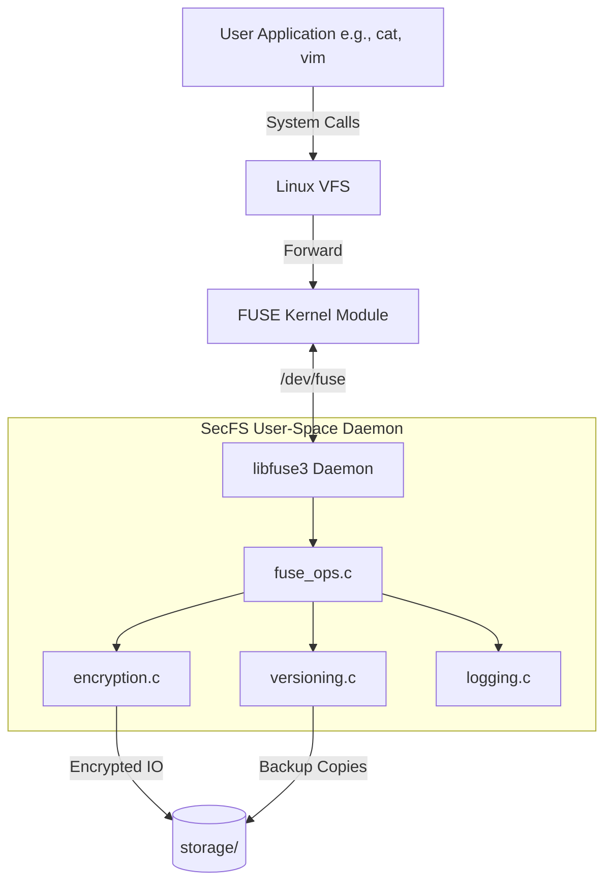

# SecFS: Technical Design, Analysis, and Project Report

This document serves as the comprehensive technical report for the **SecFS (Secure Encrypted and Versioned Filesystem)** project. It details the system architecture, cryptographic design calculations, storage impact analyses, and operational workflows.

---

## 1. Project Overview
**SecFS** is a user-space filesystem built using `libfuse3` on Linux. Its primary objective is to provide a transparently secure storage medium that inherently protects data at rest while maintaining a historical record of file modifications. 

### Core Objectives:
*   **Confidentiality:** Data must remain encrypted on disk, immune to offline attacks.
*   **Resilience:** File modifications must be non-destructive, allowing rollback to previous states.
*   **Audibility:** All filesystem interactions must be securely logged for forensic analysis.

---

## 2. System Design & Architecture
SecFS operates in user space, intercepting standard VFS (Virtual Filesystem Switch) calls via the FUSE kernel module. 

---

## 3. Cryptographic Design & Calculations

### 3.1 Algorithm Selection
*   **Cipher:** AES-256-CBC (Advanced Encryption Standard, Cipher Block Chaining mode, 256-bit key).
*   **Padding:** PKCS#7 (ensures data aligns to the 16-byte block size).
*   **Key Derivation Function (KDF):** PBKDF2-HMAC-SHA256 with 10,000 iterations.

> [!IMPORTANT]
> A unique 16-byte cryptographically secure random Initialization Vector (IV) is generated via `RAND_bytes()` for *every* write operation. This ensures semantic security—identical plaintexts will yield different ciphertexts.

### 3.2 Storage Overhead Calculations
When SecFS encrypts a file, it adds metadata to the resulting file on disk. The physical storage calculation for any given plaintext file of size $P$ bytes is:

1.  **IV Overhead:** 16 bytes.
2.  **Size Metadata:** 4 bytes (stored as `uint32_t` to track exact unpadded size).
3.  **Ciphertext Size:** $P$ rounded up to the nearest multiple of the AES Block Size (16 bytes), plus 1 extra block if $P$ is already a multiple of 16 (due to PKCS#7).

**Formula:**
$$ S_{enc} = 16 + 4 + \left( \lfloor P / 16 \rfloor + 1 \right) \times 16 $$

**Calculation Study:**
| Plaintext Size ($P$) | Padding Added | Total Encrypted Size ($S_{enc}$) | Overhead % |
| :--- | :--- | :--- | :--- |
| 1 byte | 15 bytes | 16 + 4 + 16 = 36 bytes | 3500% |
| 16 bytes | 16 bytes | 16 + 4 + 32 = 52 bytes | 225% |
| 1024 bytes (1 KB) | 16 bytes | 16 + 4 + 1040 = 1060 bytes | ~3.5% |
| 1048576 bytes (1 MB)| 16 bytes | 16 + 4 + 1048592 = 1048612 bytes| ~0.003% |

**Analysis:** The cryptographic overhead is negligible for large files but introduces significant relative storage amplification for extremely small files (micro-files).

---

## 4. Versioning System Analysis

The versioning module (`versioning.c`) automatically intercepts modifications (`write` and `truncate`). Before data is altered, the *existing encrypted raw file* is duplicated byte-for-byte into the `.versions/` directory.

### 4.1 Namespace Flattening Design
To support subdirectories without duplicating complex folder trees, SecFS employs a namespace flattening algorithm.
*   **Path:** `docs/report.txt`
*   **Flattened Name:** `docs__report.txt`
*   **Version File:** `storage/.versions/docs__report.txt.v1`

### 4.2 Storage Growth Study
Since versions are full duplicate copies (not diff-based deltas), the storage requirement scales linearly $O(N)$ with the number of modifications. 

> [!WARNING]
> **Storage Implication:** Frequent small writes to a large file will result in rapid storage consumption. In a production environment, implementing differential backups (e.g., storing binary diffs/patches) or a maximum version limit (e.g., keeping only the last 5 versions) is recommended.

---

## 5. System Testing & Simulations

The system behavior is verified via an automated bash script (`test.sh`) that simulates concurrent user operations. The simulation covers:

1.  **Encryption Correctness:** Writing plaintext, reading ciphertext directly from `storage/` to verify high entropy, and reading via `mountpoint/` to ensure deterministic decryption.
2.  **Versioning Triggers:** Sequential updates to a file to verify `v1`, `v2`, `v3` creation.
3.  **Namespace Integrity:** Renaming files (`mv`), ensuring version history links are broken cleanly, and deleting files (`rm`) while verifying versions are intentionally retained for recovery.
4.  **Concurrency Testing:** The underlying daemon uses mutexes (`pthread_mutex_t`) in `logging.c` to serialize log writes, preventing race conditions during parallel I/O.

---

## 6. Security Analysis & Threat Model

### 6.1 Threat Mitigations
*   **Offline Storage Attack:** An attacker stealing the physical disk can only access `storage/`. Without the PBKDF2 passphrase, the AES-256-CBC ciphertext is computationally infeasible to crack.
*   **Metadata Leakage:** The file size is partially leaked (padded to 16 bytes). Filenames and directory structures are *not* encrypted in this implementation.
*   **Data Tampering (Malleability):** 
    > [!CAUTION]
    > AES-CBC does not provide cryptographic integrity. An attacker with access to the raw disk could flip bits in the ciphertext, which would result in randomized garbage blocks upon decryption without throwing an error. Upgrading to an Authenticated Encryption with Associated Data (AEAD) cipher like **AES-GCM** is recommended for future iterations to detect tampering.

### 6.2 Performance Impact Study
Due to the FUSE architecture, every I/O operation incurs user-to-kernel context switching latency. 
1.  **Read Latency:** $T_{FUSE\_Switch} + T_{Disk\_Read} + T_{AES\_Decrypt}$
2.  **Write Latency:** $T_{FUSE\_Switch} + T_{Version\_Copy} + T_{AES\_Encrypt} + T_{Disk\_Write}$

The bottleneck during write operations is $T_{Version\_Copy}$, as it requires a full disk I/O read/write cycle before the new write can be committed.

---

## 7. Future Datasheet Recommendations
For scaling SecFS to production levels, the following features are modeled for future integration:
1.  **Integrity Checks:** Migration from OpenSSL `EVP_aes_256_cbc` to `EVP_aes_256_gcm` to append an authentication tag.
2.  **Filename Encryption:** Scrambling filenames in `storage/` (e.g., encoding to Base64 of encrypted strings) to hide file extensions and naming semantics.
3.  **Configurable Retention:** Adding `MAX_VERSIONS` logic to automatically prune the oldest files in `.versions/`.
